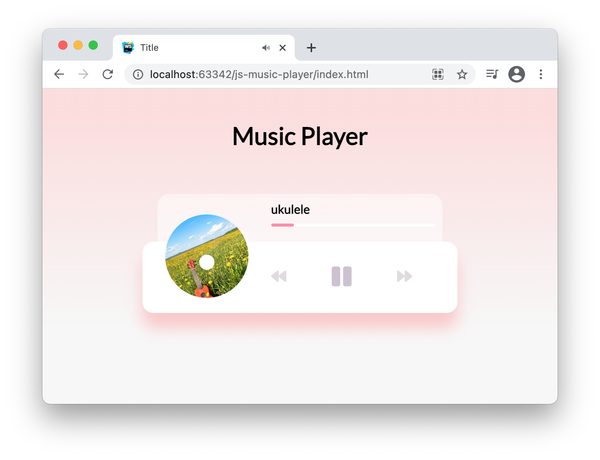

# JavaScript Vanilla Music Player

<a href="https://lytves.github.io/js-music-player/" target="_blank">Demo project on GitHub Pages</a>

You can play some mp3 files on your website using only embedded HTML5 audio API, start/pause and change the current track

+ Project is based on youtube video <a href="https://www.youtube.com/watch?v=QTHRWGn_sJw" target="_blank">Build a Music Player | Vanilla JavaScript</a> by Traversy Media
  
+ Music: <a href="https://www.bensound.com" target="_blank">Bensound</a>

### Screenshots:

